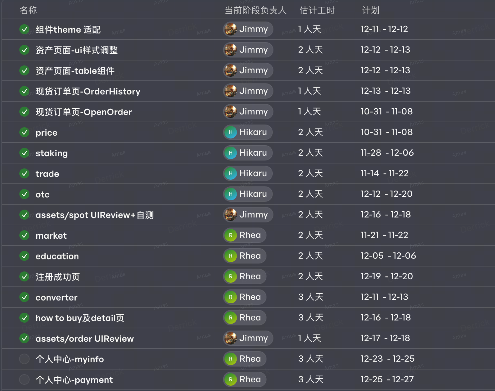
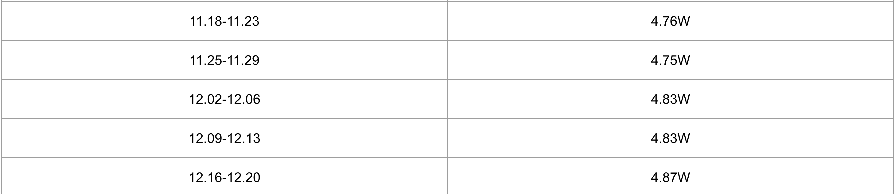
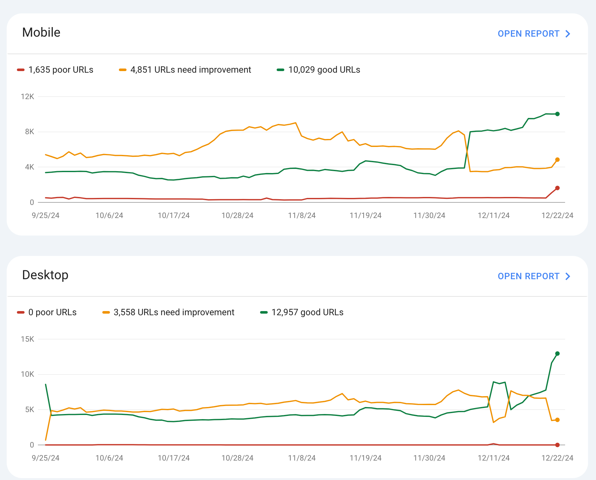
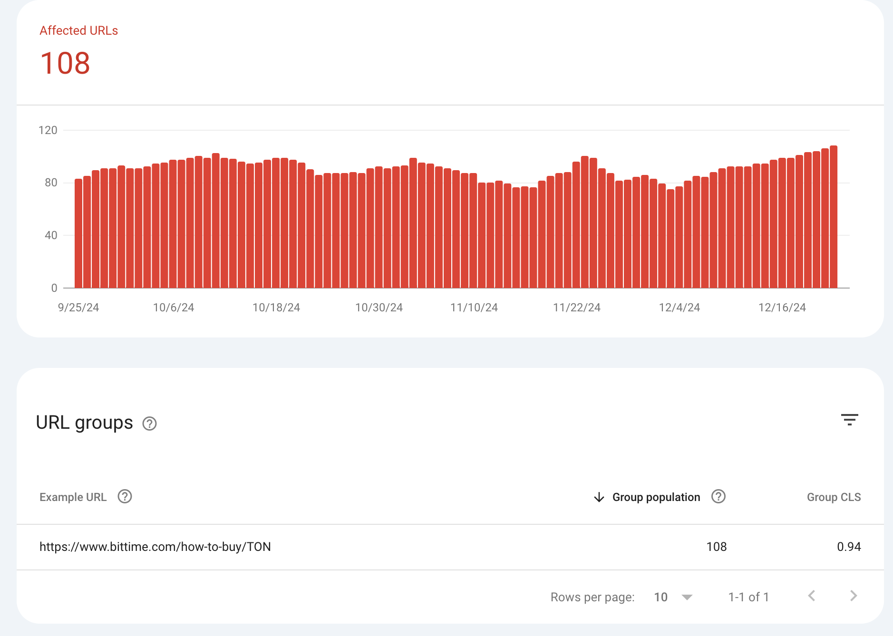
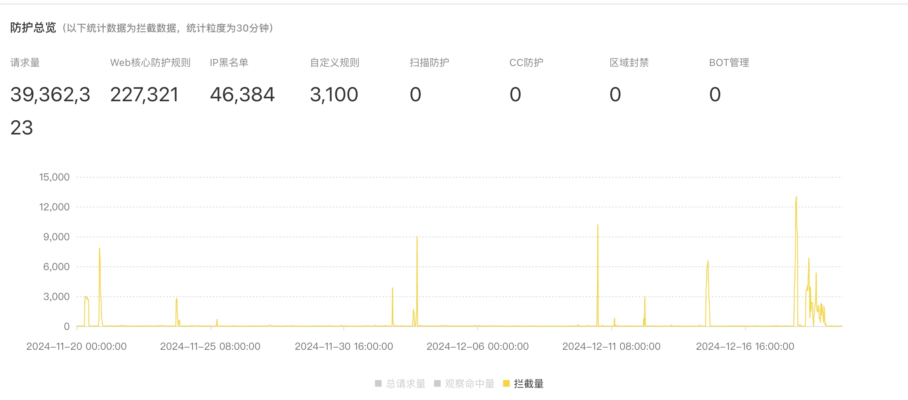
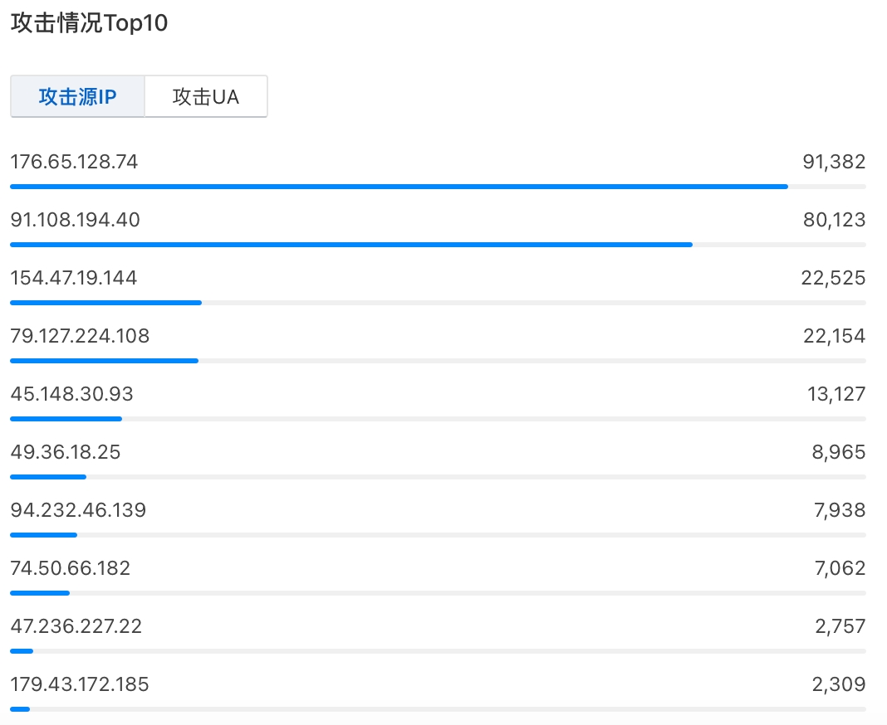
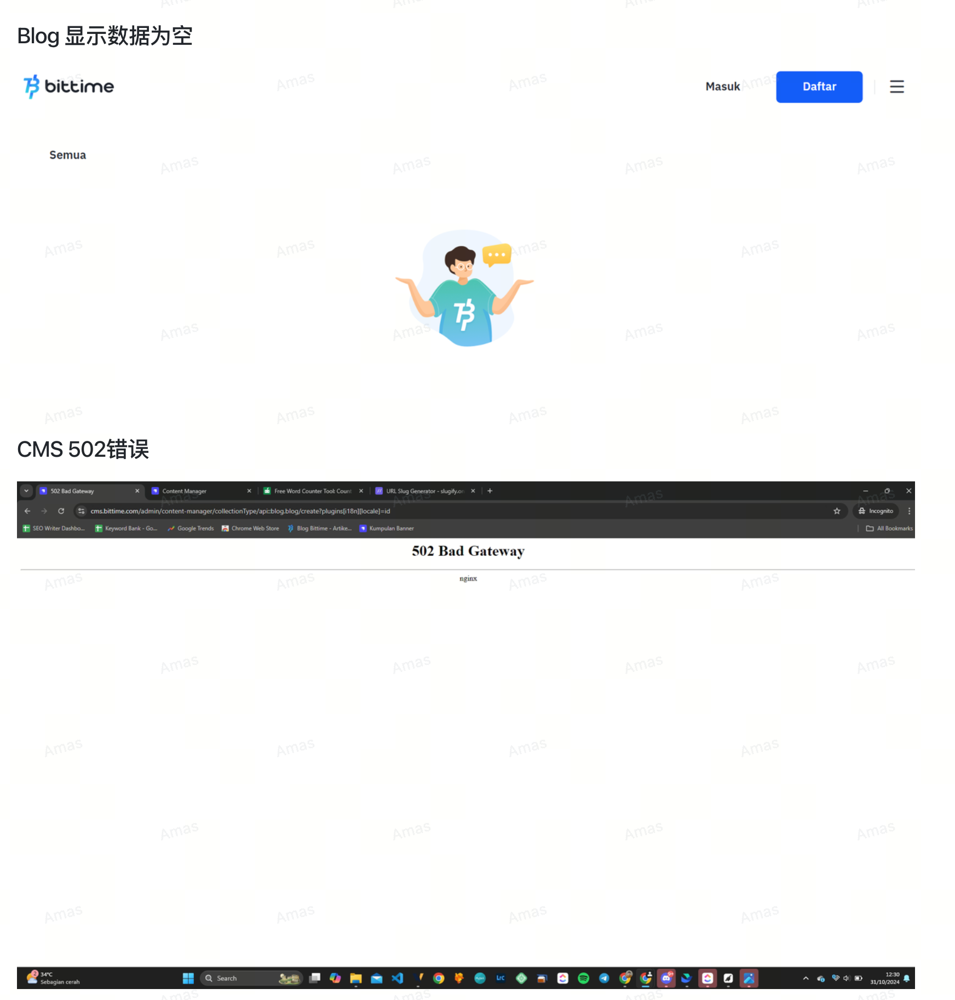
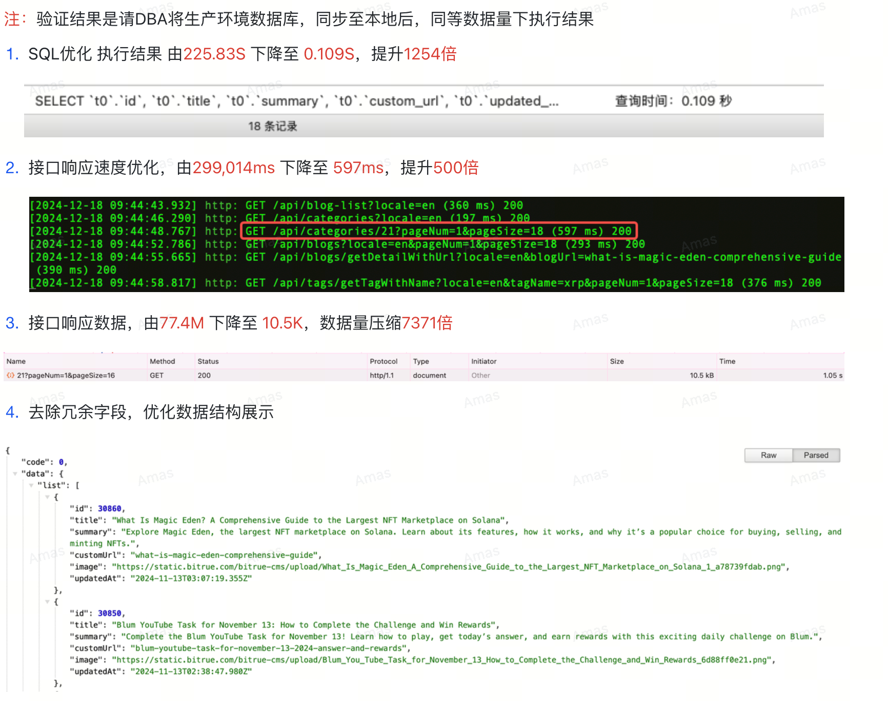
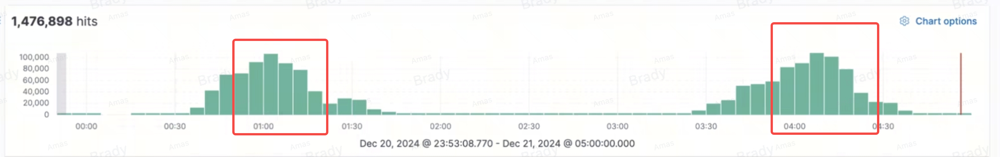

# BITTIME-2024-12

## BITTIME响应式

> 除了个人中心的两个字模块，其他模块都已经按照最新的响应式设计标准统一调整完毕，原先不支持响应式和标准不统一的都已经统一到最新标准

## SEO收录

> 历史新高，缓慢增长

## SEO综合性能（Core Web Vital）

> 针对CMS进行了少量优化，有一定效果，CMS的优化由于GMGN等高优项目推迟

> 主要是实时性接口响应慢的问题，和我们SEO数据策略有关，PRICE获取实时性过高

## 安全

11月20-12月20日的CC攻击以及其他形式攻击

防火墙（12月5日付款，预计1月15日左右到位）

## 线上问题

1. CMS相关优化问题（有方案，优先在BITRUE实施，前一到BITTIME）

   

2. SEO PRICE获取实时价格不合理，应该改为缓存形式，时间至少1小时以上 (待定)

   - 实时价格对SEO没有明显帮助，googel并不知道你的价格精确到1小时还是半天，但是给我们系统CMS/后端带来的压力非常大
   - 因为实时价格导致系统不稳定，反而容易在google并发爬取的时候出现响应时间过长等问题
   - 流量激增导致后端网管压力过大，影响其他重要业务

以下为2月20日，PRICE接口访问激增导致后端网关故障（会影响登陆等其他重要功能）

## ALPH项目（年前重点）

1. 前端
   - 基础开发环境 （完毕）
   - 代码仓库（完毕）
   - 下周按照计划UI交付部分模块，前端进行排期
2. 运维
   - 代码仓库（完毕）
   - 测试环境准备（服务端已经提出申请，下周完成）